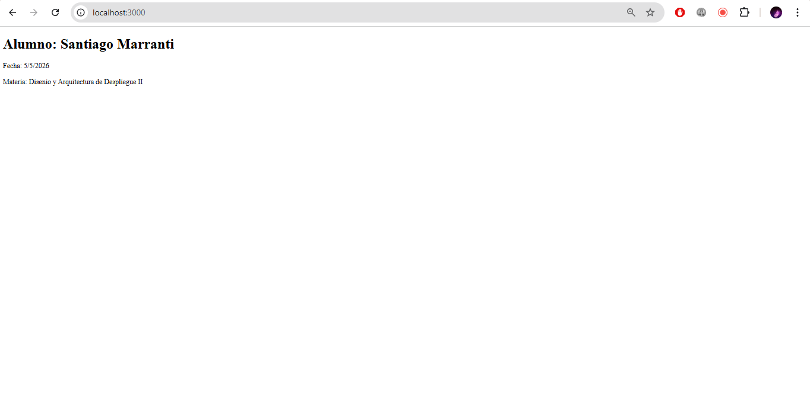
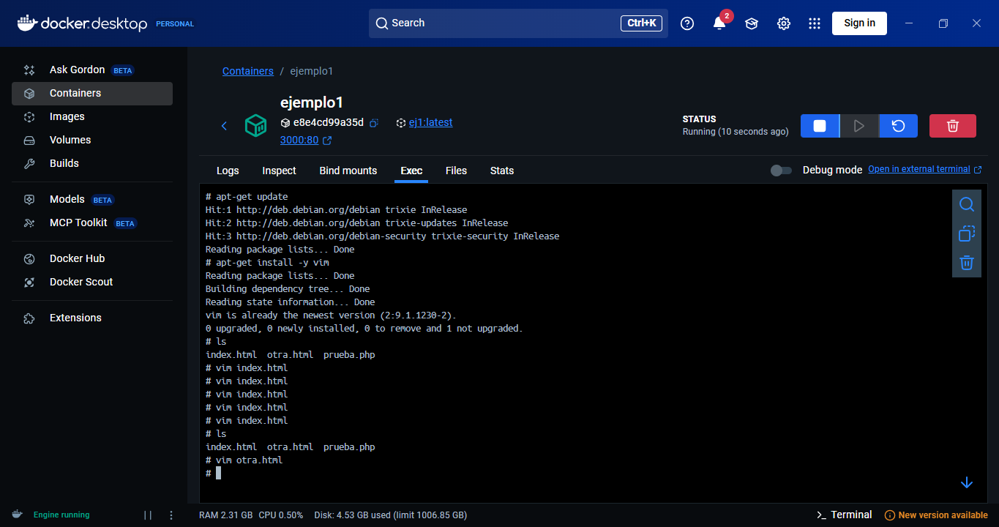
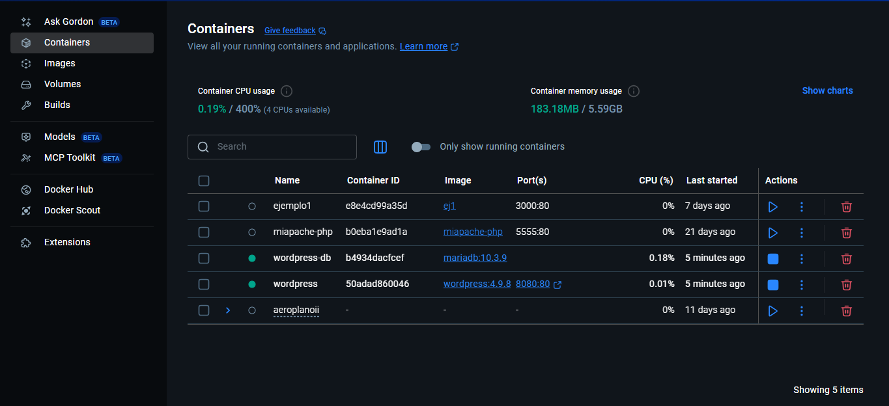
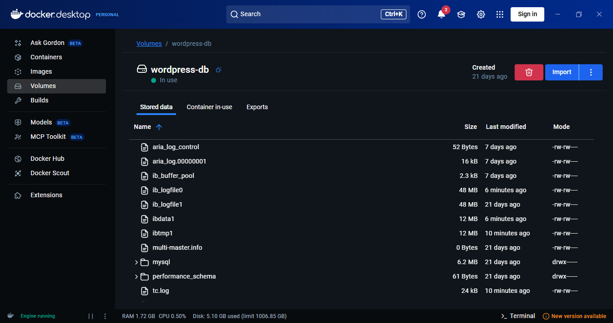
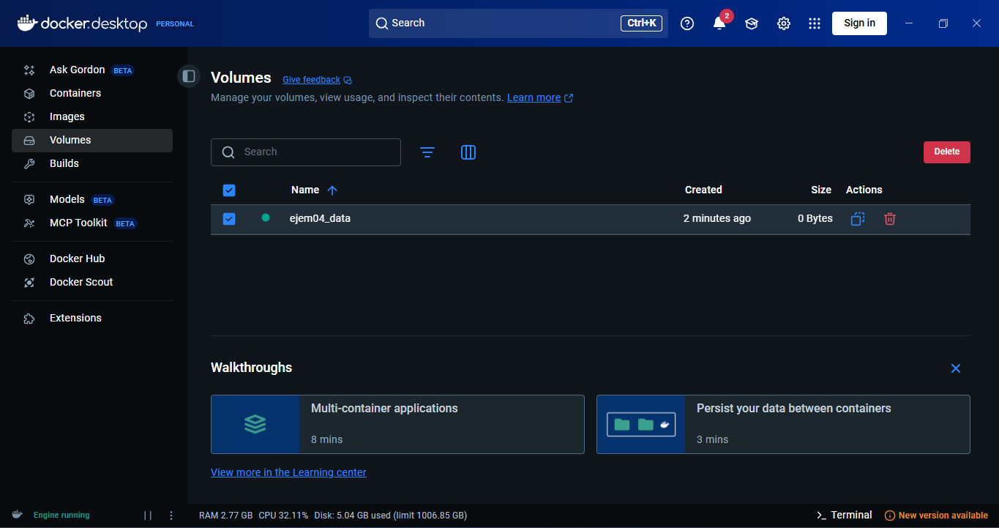
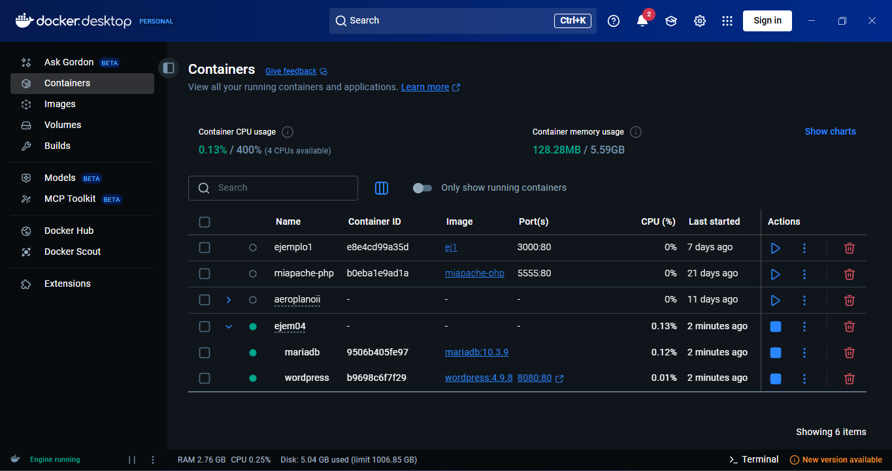
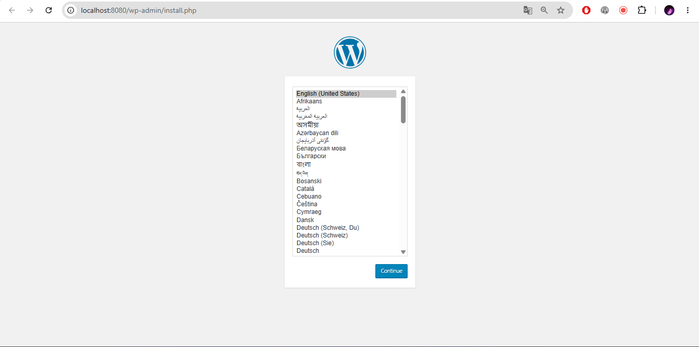

# Docker-Ejemplos

## Ejemplo 1:

## Ejemplo 2:

## Ejemplo 3:

> Evaluar inconvenientes de correr scripts de S.O. (Portabilidad, 

1. El inconveniente al ejecutar este script es que esta pensado para sistemas operativos como Linux/MacOS, entonces en Windows, es que no funcionaba tal cual estaba, con las barras que separaban cada linea. En ese caso, tuve que reemplazar las barras por backticks `` ` `` que windows lo toma como un salto de linea pero como una continuacion de parametros.

2. <b>El script asume que existen:</b>
* Docker
* Bash
* permisos suficientes
* acceso a internet
* imágenes descargables
daemon Docker corriendo

    Si algo de eso no existe, el script no lo valida antes de ejecutar.

3. <b>Falta de manejo de errores:</b>
El script sigue ejecutando aunque algo falle.

    Ejemplo:

    > falla MariaDB igual intenta levantar WordPress

    Entonces terminar en:

    > contenedor roto

    > errores difíciles de entender

    No hay:

    `set -e`

    Ni validaciones.

4. <b>Seguridad del host</b>

    El script:

    + crea contenedores 
    + abre puertos monta 
    + directorios locales 
    + guarda contraseñas

    Eso modifica el sistema anfitrión.

    Ejemplo crítico:

    `--mount type=bind`

    Le da al contenedor acceso directo a archivos del host.

    Si el contenedor es comprometido:

    > podrían modificar archivos reales del sistema.

## Ejemplo 4:

